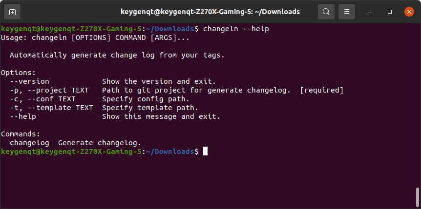

ChangelnCLI
===================

***Version**: 1.0.2*

Automatically generate **change log** from your tags.

#### Basic functionality
* Grouping by regular expression
* Parsing one comment to multiplicity
* Template engine ([Mako](https://www.makotemplates.org/))
  
#### Output
* Generating a report in **markdown** format 
* Generating a report in **pdf** format ([weasyprint](https://weasyprint.readthedocs.io/en/stable/index.html))
* Generating a report in **html** format ([python-markdown](https://python-markdown.github.io/))


### Install

#### pyz

```shell
wget https://github.com/keygenqt/ChangelnCLI/raw/master/data/changeln-1.0.2.pyz
```
```shell
# update CHANGELOG.md
python3.6 changeln-1.0.1.pyz --project=/path/to/your/project changelog markdown

# update CHANGELOG.html
python3.6 changeln-1.0.1.pyz --project=/path/to/your/project changelog html

# update CHANGELOG.pdf
python3.6 changeln-1.0.1.pyz --project=/path/to/your/project changelog pdf
```

#### snap

[](https://snapcraft.io/changeln)

```shell
sudo snap install --devmode changeln
```

```shell
# update CHANGELOG.md
changeln --project=/path/to/your/project changelog markdown

# update CHANGELOG.html
changeln --project=/path/to/your/project changelog html

# update CHANGELOG.pdf
changeln --project=/path/to/your/project changelog pdf
```

### Preview



FYI, ln	= natural **log**arithm ;)